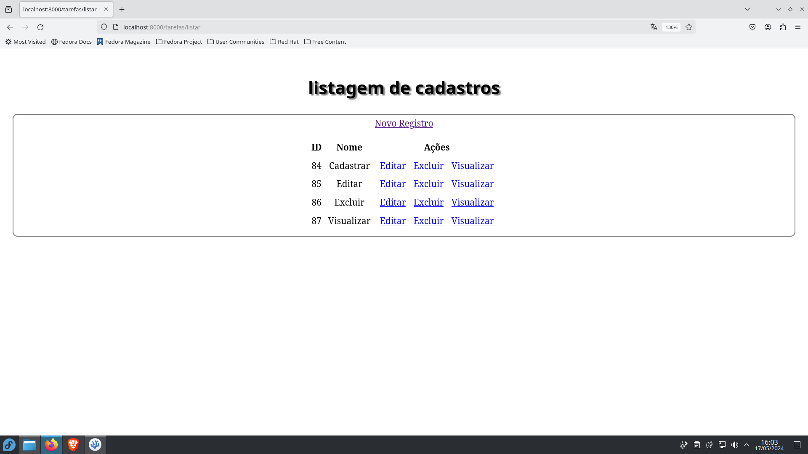

# *O que é o projeto 4Ttodo?*
O projeto se trata de um crud onde o desenvolvedor(estagiário) fará uma tela de cadastro de tarefas, Visualizar tarefas, editar tarefas e exclui-las.

# *Tecnologias e ferramentas utilizadas:*
### Para backend

1. PHP

2. Banco de dados SQLite

3. DBeaver

4. Framework Laravel (Versão 11)

### Para frontend

1. HTML

2. CSS

### Para frontend

 1. PHP 8.3.1
 2. SQLite 3.42.0
 3. Laravel 11

# *Funcionalidades do sistema:*

### CADASTRO: 

O usuário poderá cadastrar no banco de dados quantas tarefas ele achar necessário. 

 

Após digitar a tarefa e clicar no botão de salvar, uma mensagem de tarefa cadastrada com sucesso será exibida na tela na cor verde.

 

mas caso o usuário queira salvar com o campo de mensagens em branco, uma mensagem de campo obrigatório será exibida em vermelho.

 

**Após cadastrar todas as tarefas, o usuário poderá ver suas tarefas clicando no link listar, que irá direciona-lo para a tela de listagem.**

### LISTAGEM:
 
Na tela de listagem, o usuário verá suas tarefas listadas uma abaixo da outra na ordem que foi cadastrada e ao lada de cada tarefa, terá links com as opções de atualizar, excluir e visualizar. Logo acima da lista, terá um link de novo registro, que redirecionará o usuário caso queira adicionar uma nova tarefa.

 

### ATUALIZAR:

Caso o usuário deseje alterar uma tarefa, basta que ele clique no link de atualizar e ele redirecionará para a tela de atualização de tarefa. Nessa tela o usuário terá que preenher o campo com a nova tarefa e clicar no botão de atualizar e será redirecionado de volta a lista de tarefas com a tarefa ja atualizada. Na tela de listagem, mostrará a tarefa atualizada e uma mensagem de tarefa atualizada com sucesso.

 

 

Caso o usuário queira salvar a tarefa com o campo vazio, será exbidia uma mensagem de campo obrigatório na cor vermelho na tela.

 

### EXCLUIR:

Caso o usuário queira excluir uma tarefa, basta que ele clique no link de excluir e ele redirecionará para a tela de exclusão de tarefa. Nessa tela o usuário tem a opção de excluir a tarefa selecionada pelo link ou a opção de cancelar caso tenha clicado no link por engano. 

 

Ao excluir, o usuário será redirecionado a tela de listagem de tarefas e uma mensagem de tarefa excluída com sucesso será exibida em verde na tela.

 

### VISUALIZAR:
 
Caso o usuário queira visualizar uma tarefa em específica, basta que ele clique no link de visualizar e ele redirecionará para a tela de visualização de tarefa. Nesta tela o usuário poderá ver somente a tarefa selecionada e seu ID, abaixo dela terá o botão de voltar que redirecionará para a tela de listar.

 

# *Sobre o framework Laravel*

 

Laravel é um dos frameworks para PHP mais utilizados no mercado. É um framework de aplicação web com sintaxe expressiva e elegante. O Laravel agiliza o processo de desenvolvimento flexibilizando tarefas comuns em seus projetos, como rotas, models, controllers, todos com uma estrutura já pré definida.
 A versão utilizada neste projeto foi o Laravel 11.

---
# Como criar o projeto laravel
### 1. Instalando o php:
 
---
    sudo dnf install php
---
### 1.2 Para verificar a versão do PHP:

---
    php -v
---
### 2. Instalando o composer: 

---
    php -r "copy('https://getcomposer.org/installer', 'composer-setup.php');"
---
### 2.2 Após isso, rode o comando:

---
    php -r "if (hash_file('sha384', 'composer-setup.php') 'dac665fdd8ec78b9800061b4150413ff2e3b6f88543c6f7cd84f6db9189d43a81e5503cda447da73c7e5b6') { echo 'Installer verified'; } else { echo 'Installer corrupt'; unlink('composer-setup.php'); } echo PHP_EOL;"
---
### 3. Para finalizar, rode os seguinte comandos:

---
    php composer-setup.php
    php -r "unlink('composer-setup.php');"
---
### 3.2 Criando o projeto:
---
    composer create-project laravel/laravel: (nome do projeto)
---
# *Sobre o banco de dados:*

 

SQLite é uma biblioteca em linguagem C que implementa uma base de dados SQL embutida sem a necessidade de um servidor. Para visualizar e administrar o banco de dados, você pode usar o DBeaver ou outrea ferramenta de sua preferencia.

## link para download do DBeaver:

https://www.google.com/url?sa=t&source=web&rct=j&opi=89978449&url=https://dbeaver.io/download/&ved=2ahUKEwjkxdeO2JyGAxV2qJUCHVFBANwQFnoECB4QAQ&usg=AOvVaw0sviKTtVTU6CUV6x0KSHLo

---
### Instalando SQLite:
---
    sudo dnf install sqlite
---

## Fazendo conexão com o banco:
1. Em config, clique em database.php:

 

2. Insira o nome do banco de dados SQLite:

 

3. Entre no arquivo .env:

 

Em DBCONNECTION, passe as credenciais do banco

 

**Para executar as migrações:
**
---
    php artisan migrate    
--- 

Após as migrações serem executadas, você irá perceber que agora o projeto terá o banco de dados no database.

 

# *Iniciando o servidor no terminal*:
    php artisan serve
---

**Depois de iniciar o servidor de desenvolvimento Artisan, seu aplicativo estará acessível no seu navegador da Web em http://localhost:8000.**

